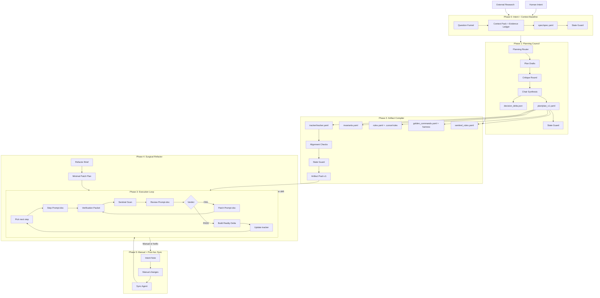

# MVP Buildkit

A **state-first workflow** for building MVPs with AI-assisted development.

This system addresses the core failure modes of "chatbot coding"—context drift, hallucinated verifications, architectural entropy—by treating human intent as something that can be **compiled into machine-validated artifacts** and executed with runtime proof.

---

## The Problem

Current AI-assisted development is held together with tape:

* **Context disappears** between sessions
* **Specs exist only in your head** (or rot in outdated docs)
* **"It works" means "it ran once"** with no verification trail
* **Manual fixes poison future automation** because the system doesn't know what you did

This compounds. By day three of an MVP build, the AI is working against an outdated mental model and you're spending more time re-explaining than building.

---

## The Solution

A governed development pipeline where:

1. **Intent becomes structured state** (`spec.yaml`) grounded by real research
2. **State compiles into execution artifacts** (tracker, invariants, rules, prompt-docs, verification harness)
3. **Execution produces runtime proof** (test results, sentinel scans, verification packets)
4. **Proof gates progression**—no "trust me, it works"
5. **Manual work syncs back** instead of creating invisible drift

---

## System Architecture



---

## Core Concepts

### Canonical State (Source of Truth)

These files govern planning and execution. They're **patch-only**—no wholesale rewrites allowed:

| File | Purpose |
|------|---------|
| spec/spec.yaml | Structured intent: user, wow slice, constraints, decisions |
| plan/plan_v1.yaml | Architecture + milestones + risk assessment |
| tracker/tracker.yaml | Step DAG with dependencies, status, proof requirements |
| invariants/invariants.yaml | Contracts that must never be violated |
| rules/rules.yaml | Operating policies for execution |

### State Guard

Every write to canonical state must pass validation:
* Schema compliance
* No forbidden overwrites
* Cross-file consistency (e.g., tracker steps reference valid invariants)
* Version bump rules

### Verification Levels

* `human_only` — Manual inspection sufficient
* `hybrid` — Some automated, some manual
* `machine_required` — Must have passing tests/commands

High-risk surfaces (auth, payments, data, secrets) default to `machine_required`.

### Binary-First Sentinel

Sentinel **blocks only on deterministic matches**: exposed secrets, auth bypass patterns, destructive DB operations, disabled tests. Minimizes false positives.

### Exception-Based Human Review

You review only exceptions: split votes, decision changes, new dependencies, proof overrides, sentinel blocks, repeated failures. Everything else flows.

### Optimistic Concurrency

Every canonical file has `state_version`. Patches include `base_state_version`. Conflicts get "rebase required" instead of silent overwrites.

### Golden Command Registry

Verification uses only registered commands. The executor cannot invent substitute commands and call it "proof."

---

## Operating Modes

### Normal Mode

Planned work through the full pipeline. Most builds happen here.

### Hotfix Mode

Manual edits when you need to ship now. Required afterward:

* Intent note (what/why)
* Proof packet (run the harness)
* Sentinel scan
* Sync delta back to canonical state

### Refactor Mode

Triggered by repeated failures or architectural mismatch. Produces a minimal patch plan, then returns to normal execution.

---

## Directory Structure

```
research/
  research_intake.yaml              # What to research
  query_plan.yaml                   # Search strategy
  runs/<run_id>/
    evidence_ledger.yaml            # Claims with durable pointers
    synthesis_final.md              # Research report with citations

spec/
  spec.yaml                         # Canonical structured spec

plan/
  plan_v1.yaml                      # Canonical plan
  decision_delta_v1.json            # Spec patches from planning

tracker/
  tracker.yaml                      # Step DAG with status

invariants/
  invariants.yaml                   # System contracts

rules/
  rules.yaml                        # Operating policies
.cursor/
  rules/*                           # Cursor-specific rules

verification/
  golden_commands.yaml              # Registered proof commands
  verify.sh                         # Trusted harness
  packets/*.json                    # Runtime proof

sentinel/
  sentinel_rules.yaml               # Security/safety rules
  results/*.json                    # Scan results

prompts/
  step_<id>.md                      # Execution prompts
  review_<id>.md                    # Review prompts
  patch_<id>.md                     # Fix prompts
  hotfix_sync.md                    # Post-hoc sync template
  refactor_brief.md                 # Refactor template

reviews/
  <id>.md                           # Review decisions

deltas/
  <timestamp>_<id>.json             # State change records

schemas/
  *.schema.json                     # Validation schemas
```

---

## Phase Details

### Phase 0: Intent + Context Baseline

**Goal:** Convert soft intent into grounded, structured state.

**Inputs:**
* Who is the user?
* What's the "wow" slice?
* What's "done enough"?
* What must be researched (not assumed)?

**Outputs:**
* Evidence Ledger with durable pointers (URLs, excerpts, retrieval dates)
* Context Pack referencing evidence IDs
* `spec/spec.yaml` with: north star, constraints, decisions, milestones, open questions

**Exit criteria:** Spec passes schema validation. All claims trace to evidence.

---

### Phase 1: Planning Council

**Goal:** Turn spec into executable plan with explicit risks.

**Router decides:** Single-pass (default) or council (high-risk/architectural decisions).

**Council roles (when used):**
* Builder/Architect — System coherence
* MVP/Pragmatist — Speed and scope
* Skeptic/Red-team — Failure modes and security

**Outputs:**
* `plan/plan_v1.yaml` — Architecture, milestones, step shapes, risk levels
* `decision_delta_v1.json` — Patches to spec decisions
* `exception_packet_v1.md` — Only items requiring human review

**Exit criteria:** Plan schema-valid. Decision delta applied. Exceptions resolved.

---

### Phase 2: Artifact Compiler

**Goal:** Compile the control plane for reliable Cursor execution.

**Compilation order:**
1. Tracker DAG (steps with dependencies)
2. Invariants (global + scoped contracts)
3. Rules (operating policies)
4. Golden commands + verification harness
5. Sentinel rules
6. Prompt-docs (step/review/patch for each tracker item)
7. Alignment checks

**Alignment checks:**
* Every step has prompt paths, risk level, proof policy, golden command keys
* High-risk steps have machine-required proof
* Prompt references match tracker IDs

**Exit criteria:** All artifacts pass State Guard. Alignment checks pass. Pack frozen with version tag.

---

### Phase 3: Execution Loop

**Goal:** Generate working code in safe, reviewable increments with runtime proof.

**Per-step protocol:**
1. Select next ready step (dependencies satisfied)
2. Run `step_<id>.md` prompt
3. Harness runs golden commands → verification packet
4. Sentinel scans diff → verdict (CLEAR/WARN/BLOCK)
5. Run `review_<id>.md` with diff + proof + sentinel result
6. If FAIL → patch prompt → repeat from step 3
7. If PASS → emit delta, update tracker via StateAPI

**Exit criteria:** Milestone steps complete. Required proof exists. Thin slice works end-to-end.

---

### Phase 4: Surgical Refactor

**Triggers:**
* Repeated step failures (≥2)
* Persistent sentinel warnings
* Complexity threshold crossed
* Delta conflicts accumulating

**Protocol:**
1. Write refactor brief (symptoms + evidence)
2. Router: single-pass or council
3. Draft minimal patch plan
4. Compile into tracker steps
5. Execute via Phase 3 loop

**Exit criteria:** Blocked path unblocked. Build stability restored.

---

### Phase 5: Manual + Hotfix Mode

**When you just need to code:**

1. Write intent note (what/why/expected behavior)
2. Make manual edits
3. Run harness → proof packet
4. Sentinel scan
5. Sync agent emits: delta + tracker update + spec patches if needed

**Exit criteria:** Delta exists. Canonical state updated. Sentinel not blocking.

---

## What Makes Good Prompt-Docs

Prompt-docs are step documents, not immutable prompts:

* **Objective** — What this step accomplishes
* **Acceptance criteria** — How to know it's done
* **Dependencies** — Files, modules, previous steps required
* **Don't-do constraints** — Scope boundaries
* **Deliverables** — Exact files to create/change
* **Proof command keys** — Which golden commands to run
* **Risk level + proof policy** — What verification is required
* **Status pattern** — `PENDING` / `EXECUTED` / `ARCHIVED` / `superseded by X`

---

## Intentionally Deferred

Not in this version (add when needed):

* **Rebaseline / delta compaction** — Only after you feel delta bloat
* **Trusted directory infrastructure** — Anti-log-forging hardening
* **Cross-model audits everywhere** — Use sparingly for high-risk only

---

## Getting Started

### Minimum Viable Pipeline (Weekend Build)

1. **Phase 0:** Question funnel prompt + `spec.yaml` schema + basic validation
2. **Phase 2:** Template generation for tracker, prompts, rules
3. **Phase 3:** Manual execution of one step cycle (step → verify → review → delta)

Stub the councils, skip Phase 4, do manual sync for hotfixes. Get one end-to-end cycle working first.

### Full Implementation

See the implementation checklist (coming soon) for build order:

1. Schemas first
2. State Guard
3. StateAPI patch verbs
4. Verification harness
5. Sentinel scanner
6. Phase 0 prompts
7. Phase 1 council logic
8. Phase 2 compiler
9. Phase 3 loop orchestration

---

## Why This Works

The system succeeds because it respects two truths:

1. **Code is runtime truth** — Only passing tests and working software matter
2. **Spec is intent truth** — What you're building and why must stay coherent

Everything else—the councils, the verification packets, the sentinel scans, the deltas—exists to keep those two truths aligned while letting you move fast.

When they drift apart, projects fail. This system makes drift visible and recoverable instead of silent and fatal.

---

## Council CLI (This Repo)

This repository contains **Phase 1: Planning Council** as a working CLI implementation:

```bash
# Run a multi-model council
council run plan \
  --project my-project \
  --packet council/packets/plan_packet.md \
  --models openai/gpt-5-mini,anthropic/claude-haiku-4.5,google/gemini-2.5-flash-lite \
  --chair openai/gpt-5-mini

# View results
council show <run_id> --section synthesis

# Approve and commit
council approve <run_id> --approve
council commit <run_id> --repo /path/to/target
```

See `council --help` for full CLI documentation.
